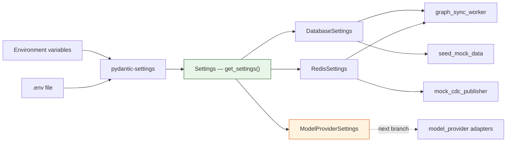

# Phase 0 — Config Management

```mermaid
flowchart LR
    ENV["Environment variables"] --> PS["pydantic-settings"]
    DOTENV[".env file"] --> PS
    PS --> SETTINGS["Settings — get_settings()"]
    SETTINGS --> DB["DatabaseSettings"]
    SETTINGS --> REDIS["RedisSettings"]
    SETTINGS --> MP["ModelProviderSettings"]

    DB --> WORKER["graph_sync_worker"]
    DB --> SEED["seed_mock_data"]
    REDIS --> WORKER
    REDIS --> PUB["mock_cdc_publisher"]
    MP -.->|next branch| PROVIDER["model_provider adapters"]

    style SETTINGS fill:#e8f5e9,stroke:#1b5e20
    style MP fill:#fff3e0,stroke:#e65100
```