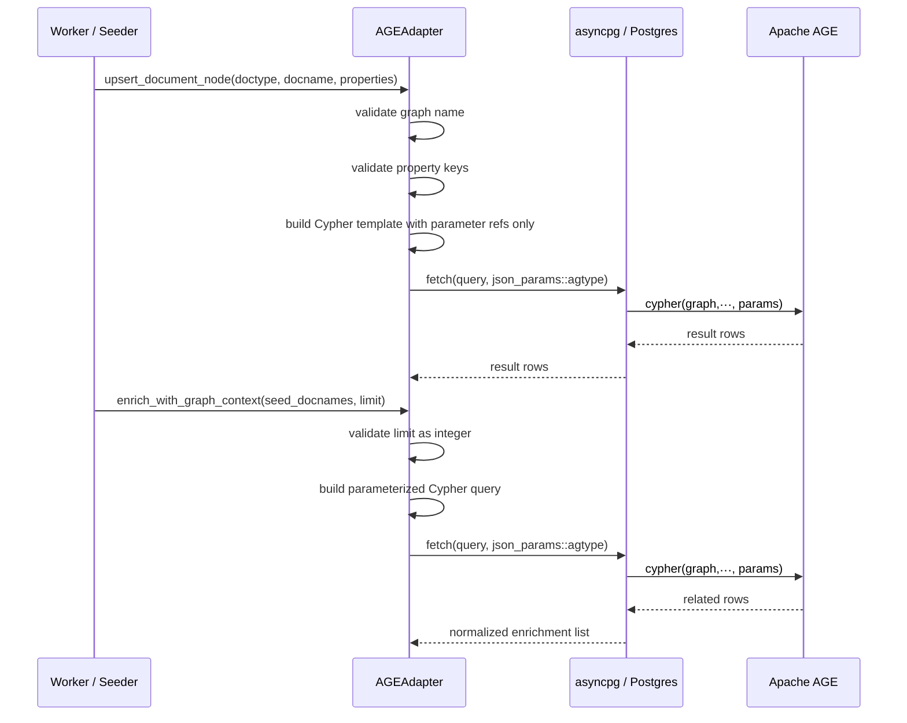

# Phase 0 — Cypher Parameterization

```mermaid
sequenceDiagram
    participant Caller as Worker / Seeder
    participant AGEAdapter as AGEAdapter
    participant Asyncpg as asyncpg / Postgres
    participant AGE as Apache AGE

    Caller->>AGEAdapter: upsert_document_node(doctype, docname, properties)
    AGEAdapter->>AGEAdapter: validate graph name
    AGEAdapter->>AGEAdapter: validate property keys
    AGEAdapter->>AGEAdapter: build Cypher template with parameter refs only
    AGEAdapter->>Asyncpg: fetch(query, json_params::agtype)
    Asyncpg->>AGE: cypher(graph, $$...$$, params)
    AGE-->>Asyncpg: result rows
    Asyncpg-->>AGEAdapter: result rows

    Caller->>AGEAdapter: enrich_with_graph_context(seed_docnames, limit)
    AGEAdapter->>AGEAdapter: validate limit as integer
    AGEAdapter->>AGEAdapter: build parameterized Cypher query
    AGEAdapter->>Asyncpg: fetch(query, json_params::agtype)
    Asyncpg->>AGE: cypher(graph, $$...$$, params)
    AGE-->>Asyncpg: related rows
    Asyncpg-->>AGEAdapter: normalized enrichment list
```