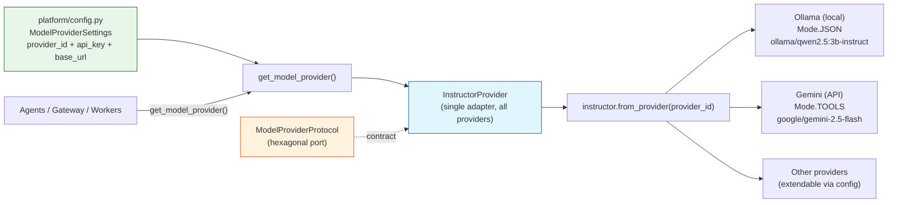

# Phase 0 — Model Provider Adapters (Decision Log #6)

## Key Design Decisions

| Decision | Rationale |
|---|---|
| Single adapter, not per-provider classes | `instructor.from_provider()` handles routing; less code, same contract |
| Ollama uses `Mode.JSON` | Prevents crashes when model outputs plain text (preserves original fix) |
| Other providers use `Mode.TOOLS` | More reliable structured extraction for API models |
| Provider selected via config string | Swapping providers is a `.env` change, not a code change (NFR-AI-5 prep) |
| Factory function as single seam | Callers never instantiate adapters directly — one place to change |