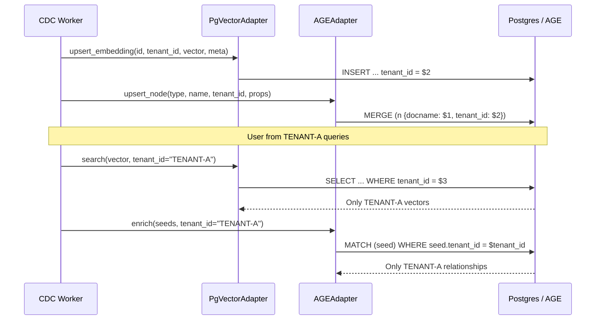

## Phase 0 — Tenant Isolation (NFR-AI-3)

```mermaid
sequenceDiagram
    participant Worker as CDC Worker
    participant Vec as PgVectorAdapter
    participant Graph as AGEAdapter
    participant DB as Postgres / AGE

    Worker->>Vec: upsert_embedding(id, tenant_id, vector, meta)
    Vec->>DB: INSERT ... tenant_id = $2
    
    Worker->>Graph: upsert_node(type, name, tenant_id, props)
    Graph->>DB: MERGE (n {docname: $1, tenant_id: $2})
    
    Note over Worker,DB: User from TENANT-A queries
    
    Worker->>Vec: search(vector, tenant_id="TENANT-A")
    Vec->>DB: SELECT ... WHERE tenant_id = $3
    DB-->>Vec: Only TENANT-A vectors
    
    Worker->>Graph: enrich(seeds, tenant_id="TENANT-A")
    Graph->>DB: MATCH (seed) WHERE seed.tenant_id = $tenant_id
    DB-->>Graph: Only TENANT-A relationships
```
