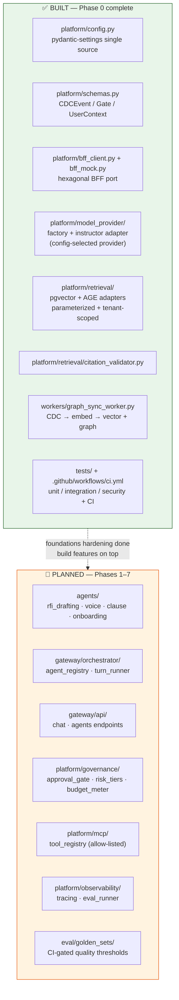
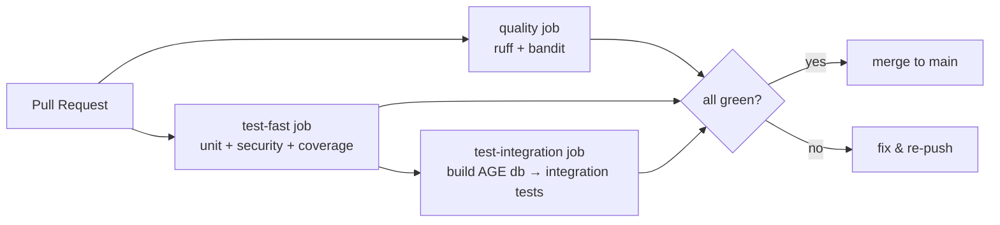

# Phase 0 — As-Built vs As-Designed Architecture

This diagram makes the gap between what exists after Phase 0 and the full
target architecture (`buildpolaris_full_architecture.md` §4) explicit, so the
remaining work is visible rather than assumed.

## CI flow

## Local dev loop (§3.4)

| Command | What runs | When |
|---|---|---|
| `uv run pytest -m unit` | unit tests only (seconds) | inner loop |
| `uv run pytest -m "unit or security"` | + adversarial/boundary tests | pre-commit |
| `uv run pytest -m integration` | containerized AGE+pgvector tests | pre-merge (needs DB up) |
| `uv run pytest -m "unit or integration or security"` | full suite | CI parity |